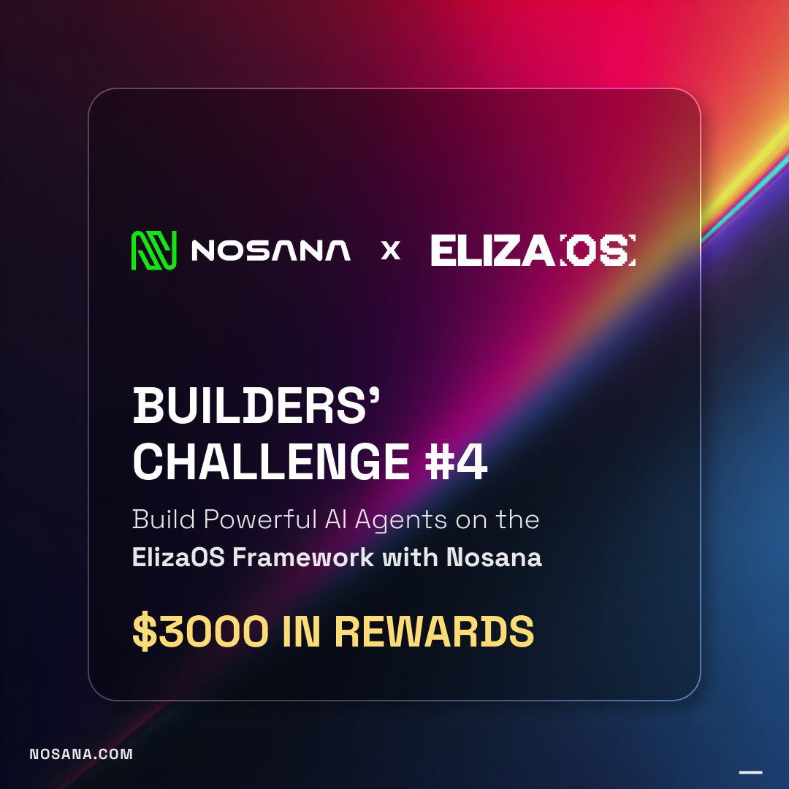

# SolSentinel



> A personal Solana DeFi watchdog that runs on decentralized infrastructure and wakes you up before you get liquidated.
> Built with **ElizaOS v2**, deployed on **Nosana**, powered by **Qwen3.5-27B**.

**Submission for the Nosana x ElizaOS Challenge.**

---

## Problem

Solana DeFi users lose money in their sleep. Leveraged positions on Kamino, MarginFi and Drift can slide into liquidation within minutes when SOL moves 5%, and none of the native dashboards will wake you up at 3am. Existing alerting tools are either centralized SaaS (Nansen, DeBank — your wallet activity becomes their data), or siloed per-protocol Discord bots that can't see your whole portfolio. A personal watchdog that actually belongs to you does not exist.

## Solution

SolSentinel is a self-hosted, single-user AI agent that continuously monitors your Solana wallet and your open DeFi positions, and pings you on Telegram in plain English when something matters. It runs 24/7 on Nosana's decentralized GPU network — not on AWS, not on a centralized SaaS — so the agent, the data, and the alerts all stay under your control. Qwen3.5-27B turns raw on-chain events into human-readable briefs: *"Your Kamino SOL/USDC position at 1.8x leverage is now 11% from liquidation — SOL dropped 4.2% in the last hour."*

## Key Features

- **Liquidation radar** — watches your Kamino / MarginFi / Drift positions and fires an alert when health factor crosses a user-defined threshold
- **Wallet anomaly detection** — flags unusual outflows, new token approvals, suspicious airdrops, and first-time interactions with unknown programs
- **Daily brief** — a 3-sentence morning summary of portfolio PnL and overnight on-chain activity, generated by Qwen3.5 and delivered to Telegram

## Tech Stack

- **Agent framework:** ElizaOS v2
- **Inference:** Qwen3.5-27B-AWQ-4bit, hosted on Nosana's decentralized endpoint (60k context)
- **Embeddings:** Qwen3-Embedding-0.6B, hosted on Nosana
- **Compute:** Nosana decentralized GPU network (Solana-secured)
- **Chain data:** Helius RPC + Jupiter Price API + Kamino / MarginFi SDKs
- **User interface:** Telegram Bot API via `@elizaos/plugin-telegram`
- **Storage:** SQLite on a mounted Nosana volume (user prefs, alert history)
- **Container:** Docker multi-stage build, <500MB final image

## Architecture

```
┌─────────────────────────┐
│       Telegram          │  ← user chats, receives alerts
└───────────┬─────────────┘
            │
┌───────────▼─────────────┐
│   ElizaOS Agent Core    │
│  (SolSentinel character)│
└───┬─────────┬───────────┘
    │         │
    │    ┌────▼─────────────────┐
    │    │ Nosana Qwen3.5-27B    │  ← natural-language reasoning
    │    │ inference endpoint    │
    │    └───────────────────────┘
    │
┌───▼──────────────────────────────────┐
│ Custom Actions (src/plugins/)        │
│  • CHECK_WALLET_HEALTH               │
│  • MONITOR_POSITIONS (cron: 1m)      │
│  • DAILY_BRIEF (cron: 7am)           │
└───┬─────────────┬────────────────────┘
    │             │
    ▼             ▼
┌─────────┐  ┌──────────────────────┐
│ Helius  │  │ Kamino / MarginFi    │
│ RPC     │  │ / Jupiter SDKs       │
└─────────┘  └──────────────────────┘

           ▲
           │ all of the above runs inside
           │ a single Nosana container
           │ backed by Solana settlement
```

## Setup & Installation

### Prerequisites

- Node.js 23+
- pnpm (`npm install -g pnpm`)
- Docker + a Docker Hub account
- Nosana builders credits ([claim here](https://nosana.com/builders-credits))
- A Telegram bot token ([create one with @BotFather](https://t.me/BotFather))

### Local development

```bash
# Clone the fork
git clone https://github.com/YOUR-USERNAME/solsentinel
cd solsentinel

# Install deps
pnpm install

# Configure environment
cp .env.example .env
# then edit .env with your values (see below)

# Run the agent
pnpm dev
```

Send your Telegram bot `/start` to begin watching a wallet.

### Environment variables

```env
# Nosana-hosted LLM (Qwen3.5-27B)
OPENAI_API_KEY=nosana
OPENAI_API_URL=https://6vq2bcqphcansrs9b88ztxfs88oqy7etah2ugudytv2x.node.k8s.prd.nos.ci/v1
MODEL_NAME=Qwen3.5-27B-AWQ-4bit

# Nosana-hosted embeddings
OPENAI_EMBEDDING_URL=https://4yiccatpyxx773jtewo5ccwhw1s2hezq5pehndb6fcfq.node.k8s.prd.nos.ci/v1
OPENAI_EMBEDDING_API_KEY=nosana
OPENAI_EMBEDDING_MODEL=Qwen3-Embedding-0.6B
OPENAI_EMBEDDING_DIMENSIONS=1024

# Solana data
HELIUS_API_KEY=your_helius_key
SOLANA_WALLET=YourWalletPubkey

# Telegram
TELEGRAM_BOT_TOKEN=123456:ABC-your-bot-token
TELEGRAM_CHAT_ID=your_chat_id

# Alert thresholds
LIQUIDATION_WARN_PCT=15   # alert when health is within 15% of liquidation
DAILY_BRIEF_HOUR_UTC=7
```

## Data Sources

- **Helius RPC** — wallet balance, token holdings, transaction history
- **Jupiter Price API** — real-time SOL/SPL token prices
- **Kamino / MarginFi SDKs** — position health factors, leverage, collateral ratios

(No custom smart contracts are deployed — SolSentinel is a read-only observer that talks to existing Solana protocols.)

## Demo

- **Live Nosana deployment:** `https://<job-id>.node.k8s.prd.nos.ci` *(updated on submission)*
- **Video demo (<1 min):** `assets/demo.mp4` *(link in submission form)*
- **Telegram bot:** `@SolSentinelBot` *(testnet mode)*

**Demo flow (30 seconds):**
1. Open Telegram → `/status` → see current portfolio in 3 lines (live Helius data)
2. `/brief` → Qwen3.5 returns a natural-language summary of the current wallet state
3. Position scanning (Kamino / MarginFi / Drift) is stubbed out until real on-chain adapters ship — no mock data is ever returned

## Future Roadmap

**Immediate (post-hackathon)**
- [ ] Add Drift perps position monitoring
- [ ] Add a `/simulate` command: "what happens to my positions if SOL drops 20%?"
- [ ] Persistent storage via a mounted Nosana volume (currently SQLite in-container)

**3 months**
- [ ] Multi-wallet support (track friends / DAO treasuries)
- [ ] Jito MEV protection alerts (flag sandwich risk on large swaps)
- [ ] Apply for a Nosana / Solana Foundation grant

**6 months**
- [ ] Nosana multi-node deployment for HA alerting
- [ ] Optional paid tier: $5/mo for 10 wallets, fully self-sovereign
- [ ] Open plugin API so other devs can add protocols

## Team

- **Kaizen** — builder, full-stack + Solana

## Sponsor Tech Used

### Nosana (core)
SolSentinel runs **end-to-end on Nosana**:
- Containerized agent deployed via `nos_job_def/nosana_eliza_job_definition.json`
- Inference via Nosana's hosted Qwen3.5-27B endpoint
- Embeddings via Nosana's hosted Qwen3-Embedding-0.6B endpoint
- Designed for long-running jobs with low resource budget (<1.5GB RAM, <0.5 vCPU)
- Health-check endpoint on `/health` for Nosana supervisor
- Meta-alignment: a Solana-native agent watching Solana, running on Solana-settled compute — a Nosana-first use case that couldn't run as well anywhere else

### ElizaOS v2
- Custom plugin with three actions (`CHECK_WALLET_HEALTH`, `MONITOR_POSITIONS`, `DAILY_BRIEF`)
- Leverages `@elizaos/plugin-bootstrap`, `@elizaos/plugin-openai`, `@elizaos/plugin-telegram`
- Character file tuned for concise, alert-style output (see `characters/agent.character.json`)

---

## Judging Criteria Alignment

| Criterion | Weight | How SolSentinel scores |
|---|---|---|
| Technical implementation | 25% | Clean Eliza plugin architecture with one action per concern, strict TypeScript, error handling on every RPC call |
| Nosana integration depth | 25% | Runs entirely on Nosana (agent + inference + embeddings), documented resource budget, multi-stage Dockerfile, health checks, `nos_job_def` tuned for long-running jobs |
| Usefulness & UX | 25% | Telegram-native (no app install, no wallet connect); natural-language alerts instead of dashboards; 30 seconds from `/start` to first alert |
| Creativity & originality | 15% | First personal Solana DeFi watchdog that's self-hosted on decentralized compute |
| Documentation | 10% | This README, inline code comments, video demo, architecture diagram |

---

## License

MIT — see [LICENSE](./LICENSE).

**Built with ElizaOS · Deployed on Nosana · Powered by Qwen3.5 · Watching Solana**
